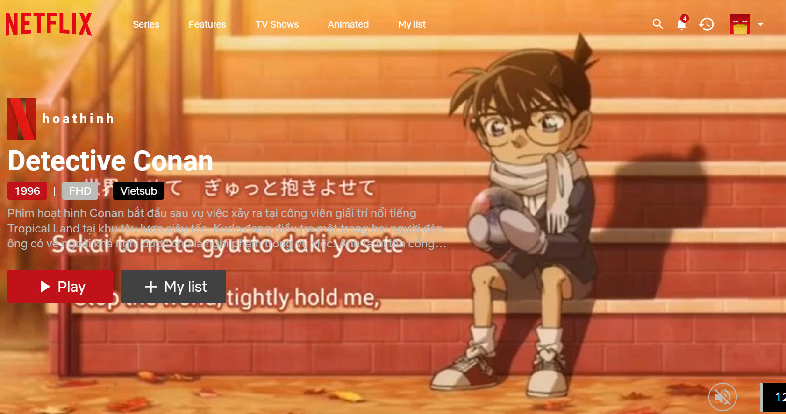
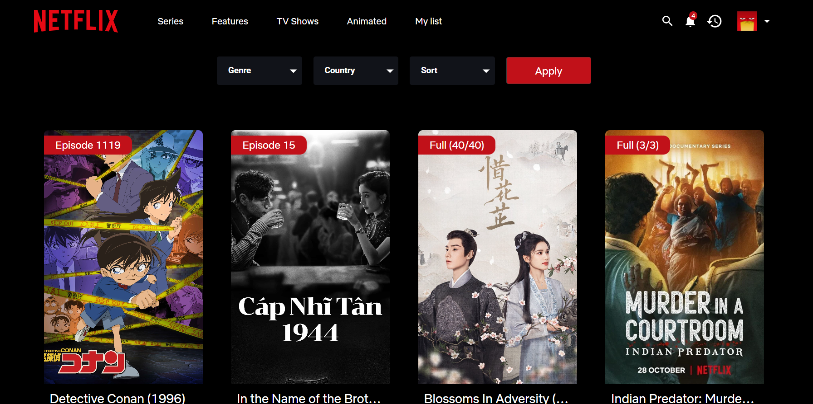
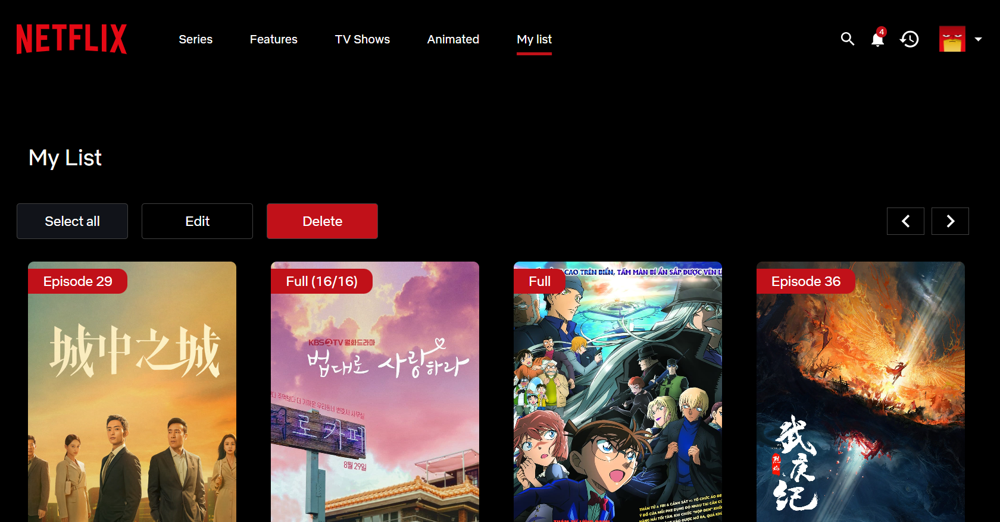
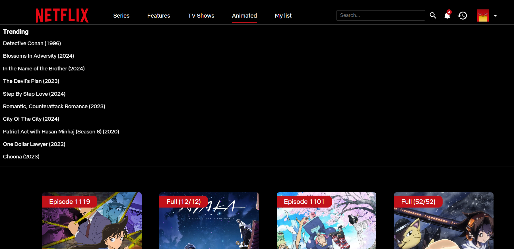
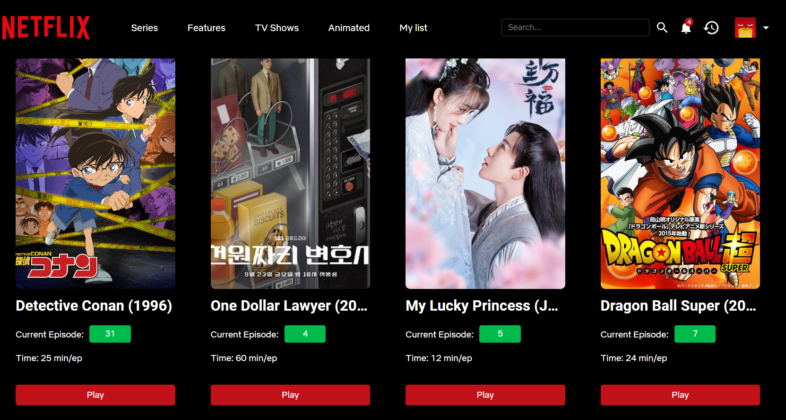
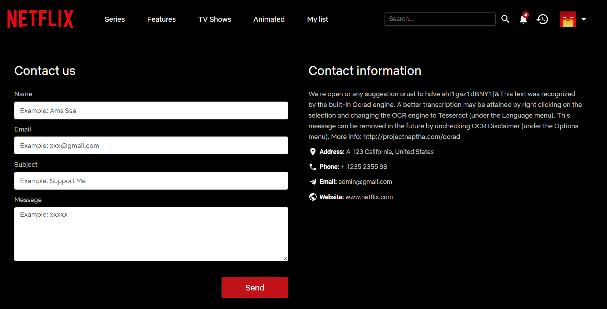
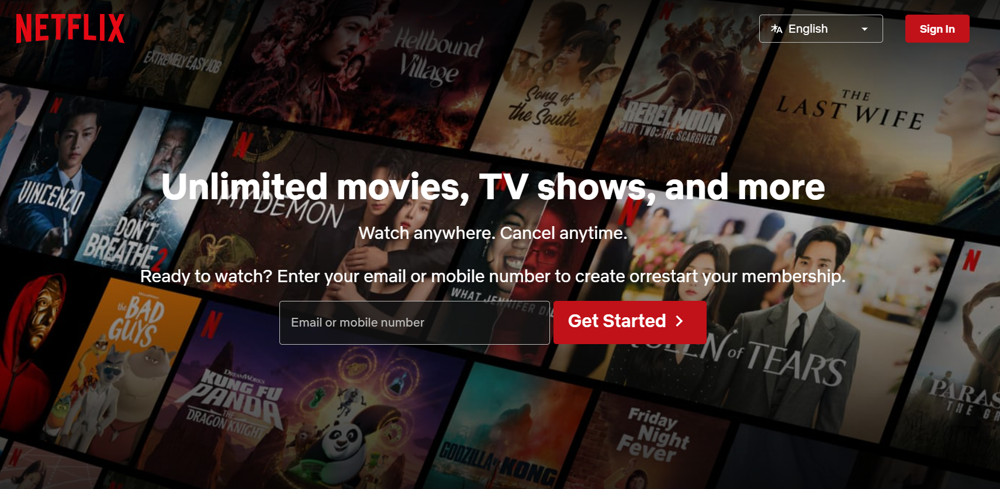
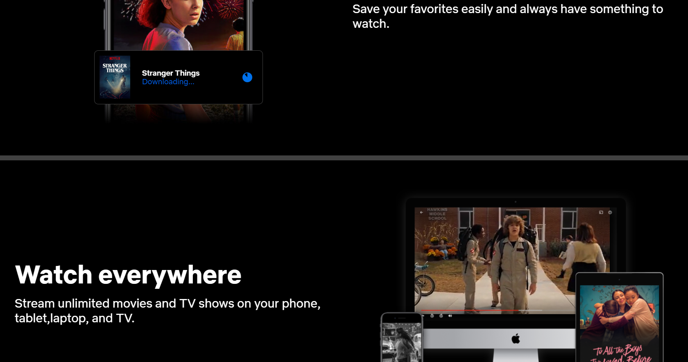
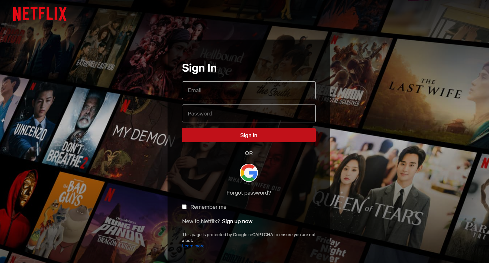
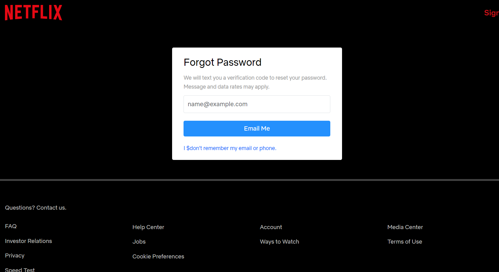

# Netflix Clone

A Netflix clone built using Node.js for the backend and React.js for the frontend. This project aims to replicate the main functionalities of Netflix, including user authentication, movie browsing, and video streaming.

## Table of Contents

- [Features](#features)
- [Technologies](#technologies)
- [Setup](#setup)
  - [Installation](#installation)
  - [Running the Project](#running-the-project)

## Features

- User Authentication (Sign up, Login, Login with Google, Logout)
- Browse Movies and TV Shows
- Watch Trailers and Movies
- Add Movies to Favorites
- Report
- Like & Dislike
- Management on the Admin side (CRUD, Lock & Unlock Accounts)

## Technologies

### Backend
- Node.js
- Express.js
- MongoDB
- Mongoose
- JWT for Authentication
- Passport.js
- WebSocket
- Cors
- Nodemailer
- ...
### Frontend
- React.js
- Material-UI
- Axios
- Chart.js
- CSS Modules
- Bootstrap
- Socket.IO-Client
- React-Toastify
- Tippy.js
- ...
## Setup

### Installation

Clone the repository:

```bash
git clone https://github.com/nguyentrunghieu25022003/netflix-clone.git
```

### Running the project:
```bash
cd netflix-clone
npm install
npm start
```










